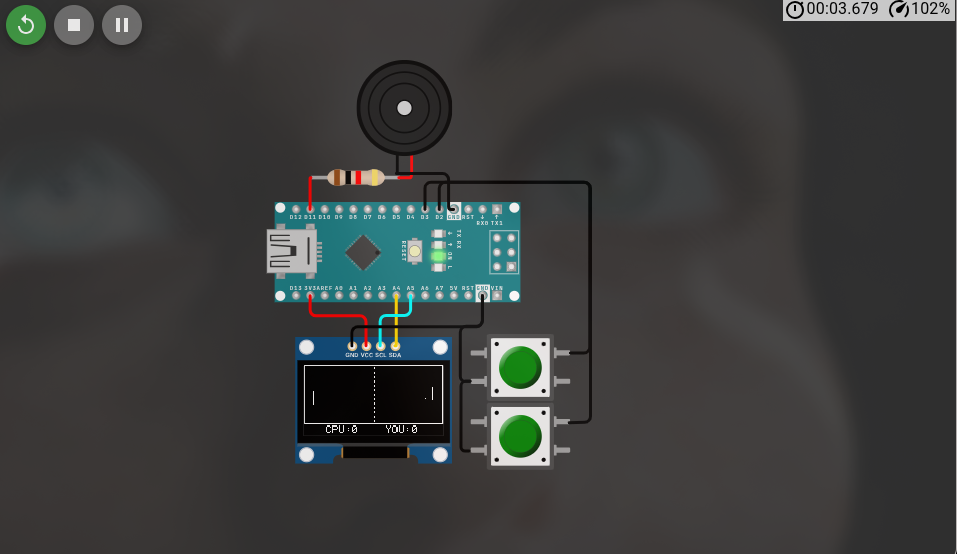

# Pong Deluxe

A compact Arduino-based Pong game built for a small OLED display and simple button controls. This project turns a standard Arduino Nano into a playable arcade-style game with a CPU opponent, score tracking, sound effects, and a turbo mode.

## Overview

Pong Deluxe is a lightweight and fun embedded systems project designed to run on an Arduino Nano with an SSD1306 128x64 OLED display. The player controls a paddle on the right side of the screen, while the built-in CPU opponent tracks the ball and tries to block shots. The game includes pause functionality, speed toggling, and an onboard buzzer for feedback.

## Features

- Classic arcade Pong gameplay
- 128x64 OLED display rendering
- Arduino Nano compatible
- Single-player mode against a CPU opponent
- Score tracking up to 9 points
- Pause and resume support
- Turbo speed toggle for faster action
- Buzzer sound effects for hits, wall bounces, and scoring
- Easy-to-build hardware setup
- Wokwi simulation support via the included diagram

## Hardware Requirements

- Arduino Nano
- SSD1306 0.96-inch OLED display (I2C, 128x64)
- 2 pushbuttons for paddle control
- Optional 2 additional buttons for pause and turbo mode
- Passive buzzer or piezo speaker
- Breadboard and jumper wires
- 5V power source or USB connection

## Pin Configuration

The code is written for the following pin layout:

- D2: Up button
- D3: Down button
- D4: Pause button
- D5: Turbo/speed button
- D11: Buzzer
- A4: OLED SDA
- A5: OLED SCL
- 3.3V: OLED VCC
- GND: Common ground

The included Wokwi schematic matches the core display and control setup used in the game.

## Required Libraries

Install these libraries in the Arduino IDE before uploading:

- Adafruit GFX Library
- Adafruit SSD1306

A copy of the required library list is also included in [libraries.txt](libraries.txt).

## Project Files

- [pong.ino](pong.ino) — main game logic and rendering code
- [diagram.json](diagram.json) — Wokwi circuit diagram for simulation
- [libraries.txt](libraries.txt) — library dependencies
- [README.md](README.md) — project documentation

## Installation

1. Open the Arduino IDE.
2. Install the required libraries listed above.
3. Open [pong.ino](pong.ino).
4. Select your board: Arduino Nano.
5. Select the correct COM port.
6. Click Upload.

## Usage

1. Power the Arduino.
2. The OLED screen displays the game court and start state.
3. Use the Up and Down buttons to move your paddle.
4. Press the Pause button to pause or resume the game.
5. Press the Turbo button to toggle faster paddle motion and gameplay speed.
6. Win the rally by reaching the score limit before the CPU does.

## Gameplay Notes

- The CPU paddle automatically tracks the ball.
- Ball speed increases as rallies continue.
- Wall hits and paddle contact trigger buzzer tones.
- A reset occurs after each scored point.
- The match ends when either side reaches the score limit.

## Simulation

This project includes a Wokwi diagram for easy virtual testing.

To simulate it:

1. Open Wokwi.
2. Load [diagram.json](diagram.json).
3. Run the simulation to test the game logic and circuit wiring without hardware.

## Development Notes

This project is a great example of embedded game development using input handling, real-time rendering, and simple state management on a microcontroller. It is well suited for learning GPIO control, display interfacing, and game loop design.

## License

This project is provided for educational and hobby use.

## Author

Created for Arduino-based game experimentation and prototyping.
